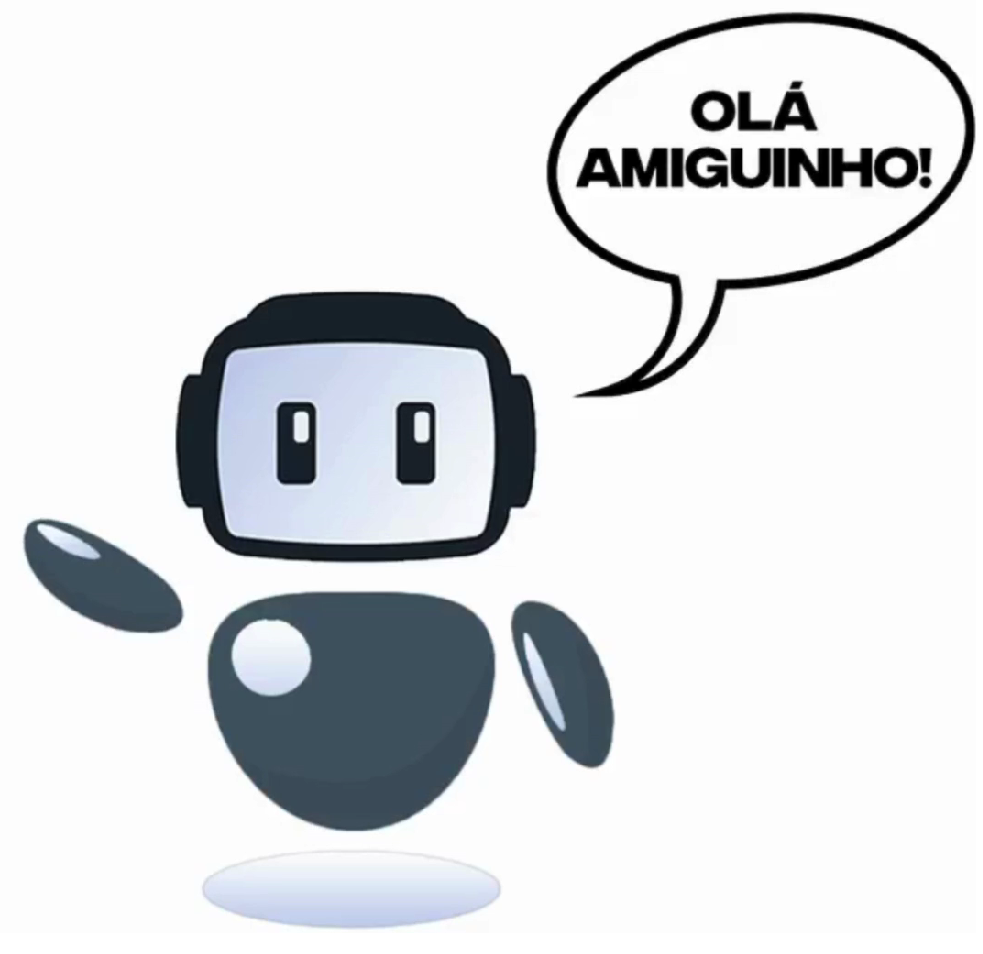
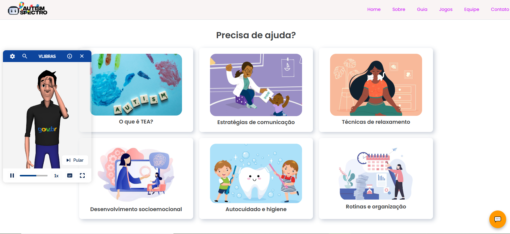
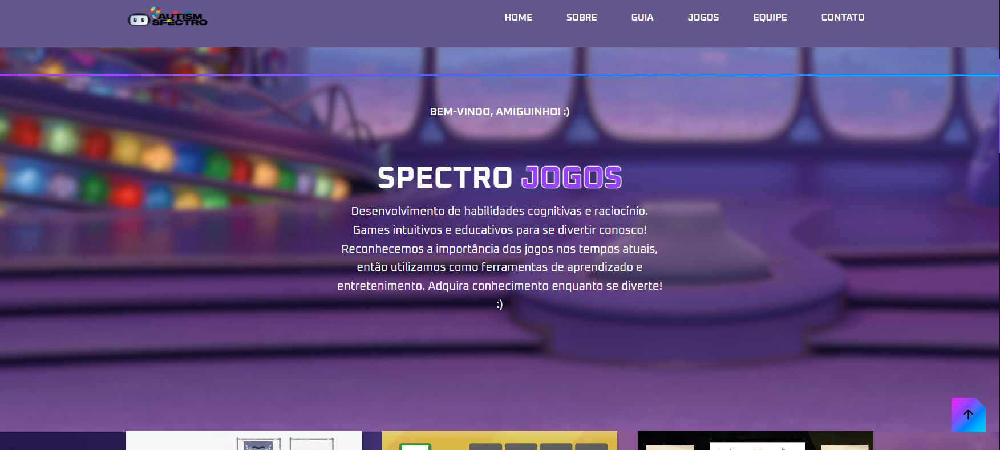
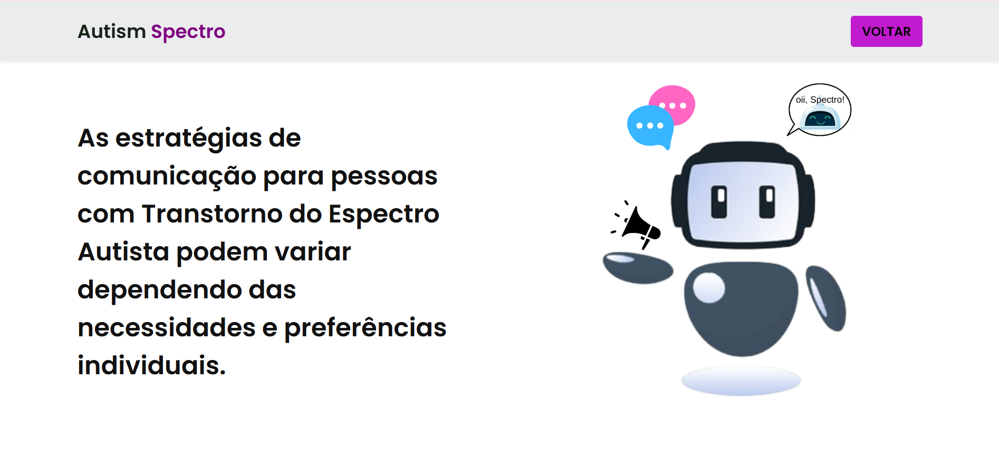
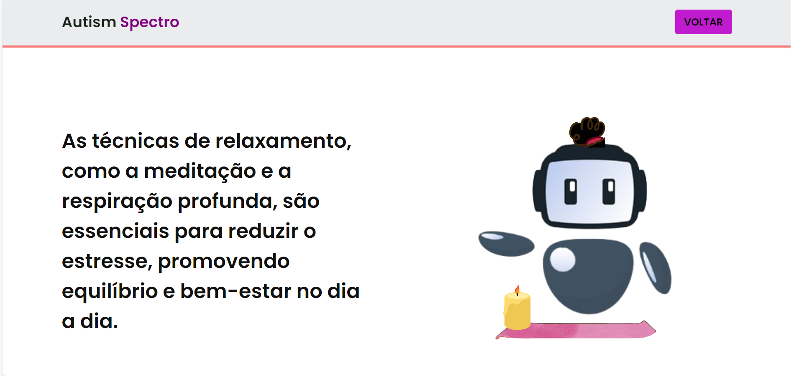

  

- 💻 Site de ajuda socioemocional para alunos com TEA;   
- 📚 Guia para professores; 
- 💚 Criado por estudantes do [Ensino Médio Senac Distrito Criativo](https://www.senacrs.com.br/unidade/84); 
- ☕ Linguagens: HTML, CSS e JavaScript;
- 📫 Contato: suporteautismspectro@gmail.com

## Email de suporte do site para contato:

 
  

  

## Tecnologias utilizadas na construção do site:

 

  

> Além destas, muitas outras ferramentas foram utilizadas para a construção do site. Git, Vercel, CodePen, BootStrap, bibliotecas externas, etc.

## 💻 Apresentação do projeto
Este trabalho tem como objetivo desenvolver um site acessível que forneça informações e recursos sobre o Transtorno do Espectro Autista (TEA), promovendo conscientização e inclusão digital. Foram organizados conteúdos especializados sobre o autismo, utilizando uma linguagem clara e inclusiva, e incorporados recursos visuais acessíveis. O desenvolvimento técnico priorizou um design inclusivo, com navegação intuitiva e ferramentas como ajuste de contraste e suporte a leitores de tela. Testes de acessibilidade e validações com especialistas em autismo garantirão que o site atenda às necessidades da comunidade autista e para o auxílio dos educadores. O projeto segue em processo de construção, baseando-se num processo de avaliação contínua, com melhorias constantes baseadas em feedback dos usuários, especialistas, visando na criação de um ambiente digital cada vez mais inclusivo e informativo.   

 
> A pesquisa e o planejamento envolveram a revisão de diretrizes de acessibilidade, como as WCAG 2.1, além da análise de sites acessíveis voltados para o público com deficiências. Incluindo pesquisas em artigos científicos e saídas de campo relacionadas ao tema para ampliação do conhecimento à respeito do TEA.

## 📜 Guia de uso
Este projeto foi feito utilizando a IDE VsCode, podendo ser acessado por um link de hospedagem no site vercel ou fazendo o download do zip pelo repositório do github. 

## 📝 Documentação Técnica
Para a construção do site Autism Spectro, foram utilizadas as linguagens HTML, CSS e JavaScript, garantindo uma estrutura sólida e interativa. A combinação dessas tecnologias possibilitou a criação de uma interface atraente e funcional, proporcionando uma experiência intuitiva para os usuários. Além disso, utilizamos o Photoshop para a criação do Spectro, nosso robô mascote, que desempenha um papel central na identidade visual do site. A animação e o design detalhado do Spectro não apenas enriquecem a estética do site, mas também ajudam a transmitir a mensagem de inclusão e apoio aos estudantes com TEA. Essa abordagem integrada reflete nosso compromisso em oferecer um ambiente virtual interativo e acessível.
 

 
## 💗 Justificativa e importância
Este projeto destaca a importância de desenvolver plataformas digitais acessíveis e inclusivas, especialmente voltadas para pessoas com Transtorno do Espectro Autista (TEA) e outras deficiências. O desenvolvimento de um site com foco na conformidade às diretrizes de acessibilidade WCAG 2.1 representa um passo crucial na promoção da inclusão digital e no fornecimento de informações acessíveis para diversos públicos, como familiares, educadores e profissionais de saúde. O desenvolvimento deste site não apenas facilita o acesso à informação, mas também atua como uma ferramenta de conscientização, contribuindo para a inclusão digital e educacional de pessoas com TEA e de seus familiares. O projeto, ao unir tecnologia e acessibilidade, reforça a importância de uma internet inclusiva, capaz de atender a todos de maneira equitativa.

## 🖥️ Histórico de desenvolvimento
Na etapa técnica, tivemos o desenvolvimento do site utilizando linguagens de marcação como HTML e CSS, além da programação em JavaScript para tornar a plataforma dinâmica e intuitiva. Foram implementados recursos de acessibilidade, como um menu robusto que inclui ajustes de contraste, aumento de fontes, navegação por teclado e compatibilidade com leitores de tela. A criação do chatbot interativo visa melhorar a experiência do usuário, especialmente para aqueles com TEA ou outras deficiências. O site tem como objetivo ser focado em um design inclusivo e responsivo, evitando sobrecarga sensorial para os usuários.  

O site foi desenvolvido com foco na inclusão digital,e oferece uma aba dedicada tanto para professores quanto para alunos. Nessa seção, os educadores têm acesso a recursos adaptados para facilitar o ensino, com atividades interativas e personalizadas, enquanto os alunos encontram conteúdos que respeitam suas necessidades de aprendizagem, que também funciona como uma ferramenta de auto ajuda. Um dos destaques dessa aba é o nosso robo personalizado (mudando a cada aba), que funciona como um mascote virtual. Com um design amigável e acolhedor, o robô interage com os usuários de forma divertida e estimulante.  

 

 

## 👨‍💻👩‍💻 Equipe responsável pelo projeto
Professora: Ana Paula de Oliveira Ramos  
Alunos que compõe a equipe: 
- | Gabriela de Araujo Poock | [Github Gabriela Poock](https://github.com/gabipoock) | ; 
- | Artur Albuquerque | [Github Artur](https://github.com/artalbsv) |; 
- | Anna Thereza Unterberger | [Github Anna Thereza](https://github.com/AnnaUnterberger) |; 
- | Camilly Andrade | [Github Camilly](https://github.com/asmillyy) |; 
- | Vitória Kereski | [Github Vitória](https://github.com/vitoriakr) | 
